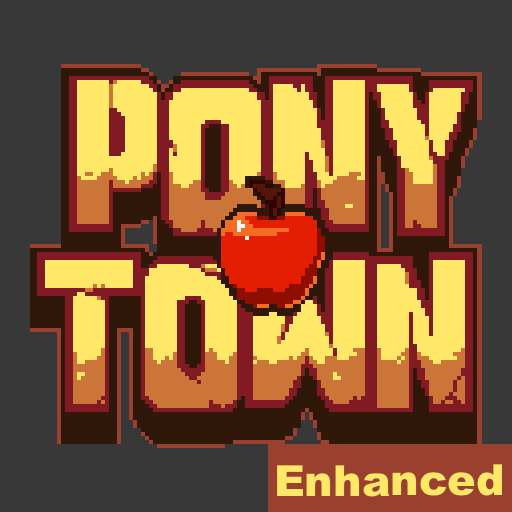
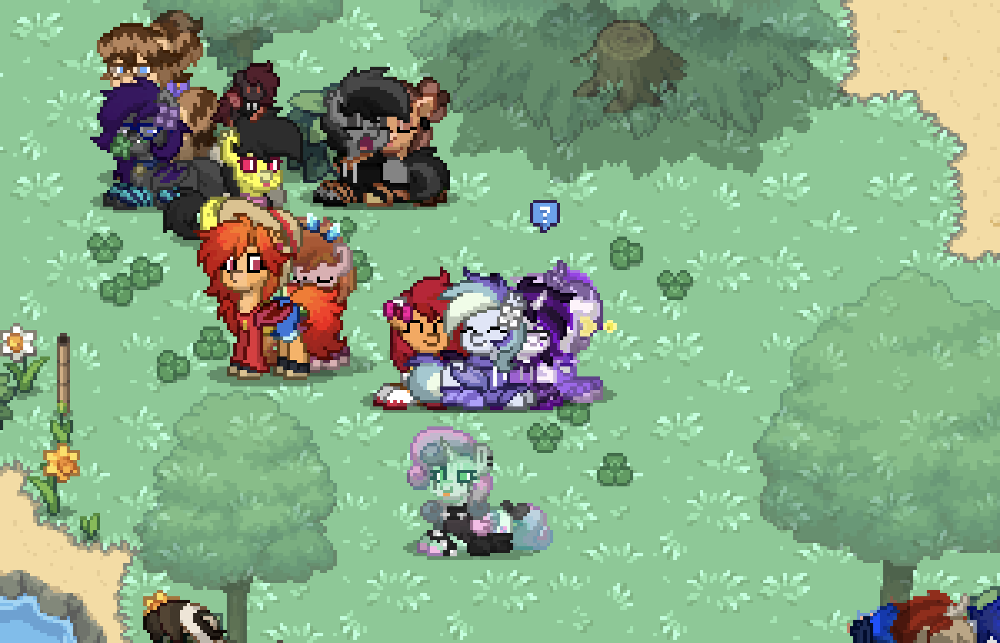
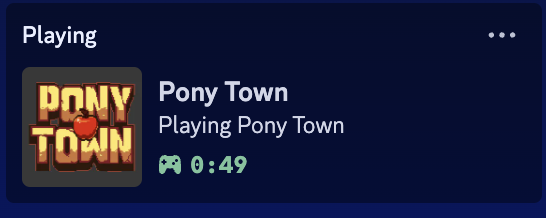
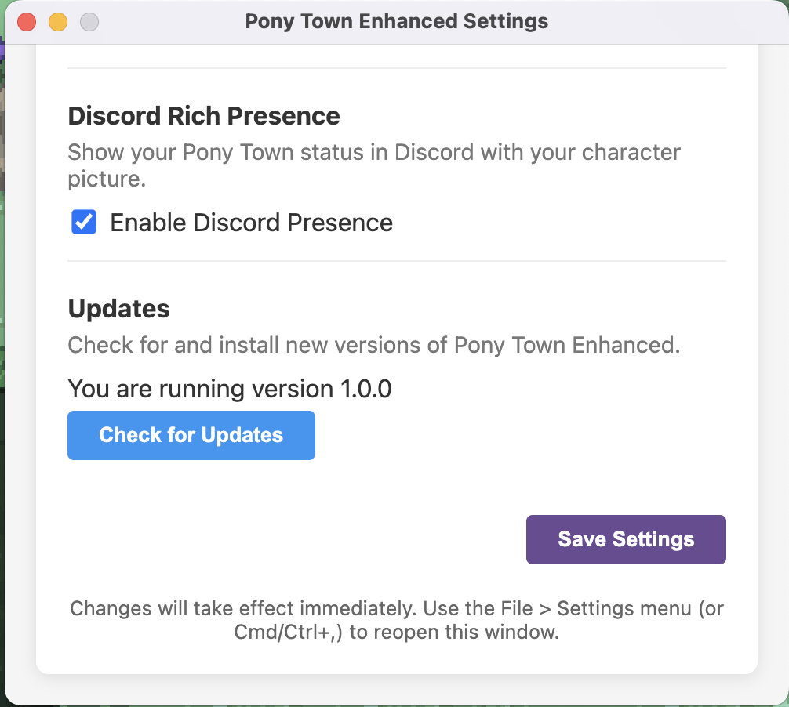

# 🦄 Pony Town Enhanced

An enhanced Electron wrapper for Pony Town that adds quality of life features while respecting the game's rules.

  

## ✨ Features

### 🔄 Auto-Rejoin
Never worry about disconnections again. The app automatically detects when you've been disconnected and clicks the reconnect button for you.

  

### 🎨 Custom Themes
Choose from several beautiful themes to customize your Pony Town experience or reduce eye strain during night sessions.

### 📷 Clean Screenshots
Take screenshots without UI elements with just a keypress (Alt+S).

  

### 💬 Enhanced Whisper Notifications
Never miss a whisper! Get desktop notifications and badge indicators when you receive whispers.

  

### 🎮 Discord Rich Presence
Show your friends you're playing Pony Town with our Discord integration.

  

### 🔄 Automatic Updates
Easily stay up to date with the latest version through our built-in update system.

  

## 🚀 Installation

### Download

Download the latest version from the [Releases](https://github.com/freddystudio/ptenhancer/releases) page.

### Platform Support

- **macOS**: macOS 10.13 or later (Intel & Apple Silicon)
- **Windows**: Windows 10 or later
- **Linux**: Ubuntu 18.04 or compatible distributions

## ⌨️ Keyboard Shortcuts

| Shortcut | Action |
|----------|--------|
| Alt+S    | Take clean screenshot |
| Alt+T    | Open theme selector |
| Alt+P    | Pin window on top |
| Alt+U    | Unpin window |
| Cmd/Ctrl+, | Open settings |

## 📜 License

This project is licensed under the MIT License - see the [LICENSE](LICENSE) file for details.

## ⚠️ Disclaimer

This is an unofficial wrapper and is not affiliated with Pony Town or its creators. Use at your own discretion.
